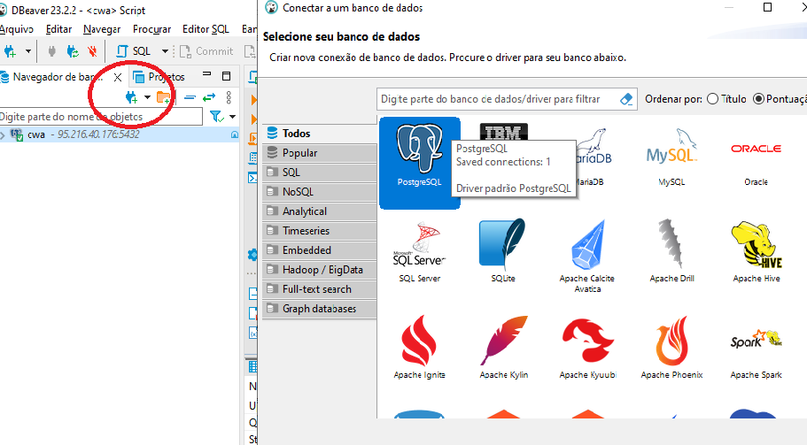
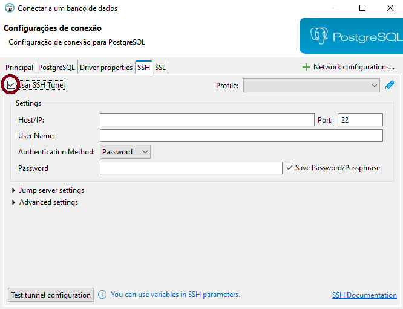
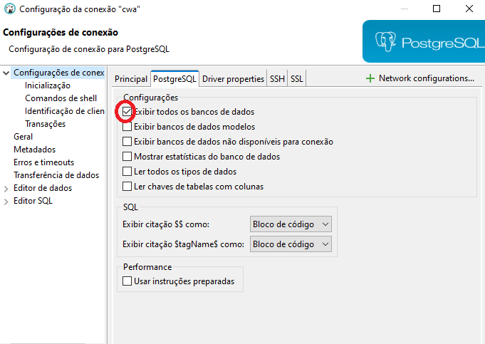
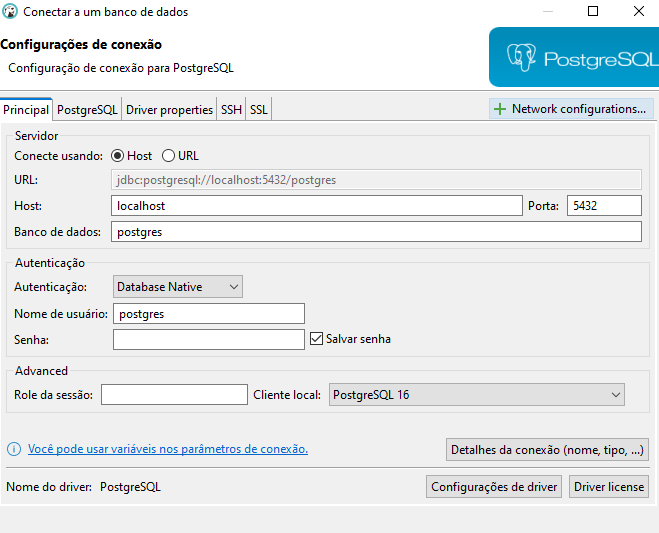

# Configure database via ssh remote

   

- 1) Depois de instalar só ir em criar um nova conexão(CTRL+SHIFT+N) banco de dados e selecionar o postgreeSQL

   

- 2) Ir na aba SSH e selecionar "Usar SSH tunel" e preencher os campos Host,User Name e Password(esses dados tem que pegar no ssh.config do seu projeto remoto).
- Após selecionar o SSH Tunel vai mais abaixo e testa "Test tunner configuration"

   

- 3) Na aba PostgreeSQL selecione essa opção!

   

- 4) Pra finalizar só verifica qual banco de dados vai selecionar e botar senha!

